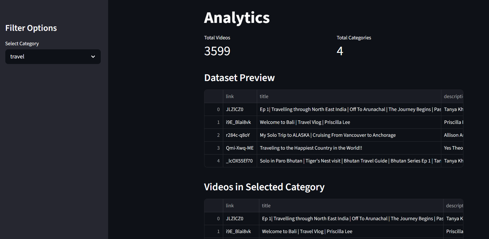
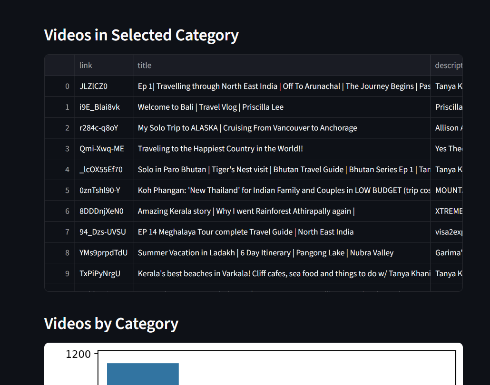
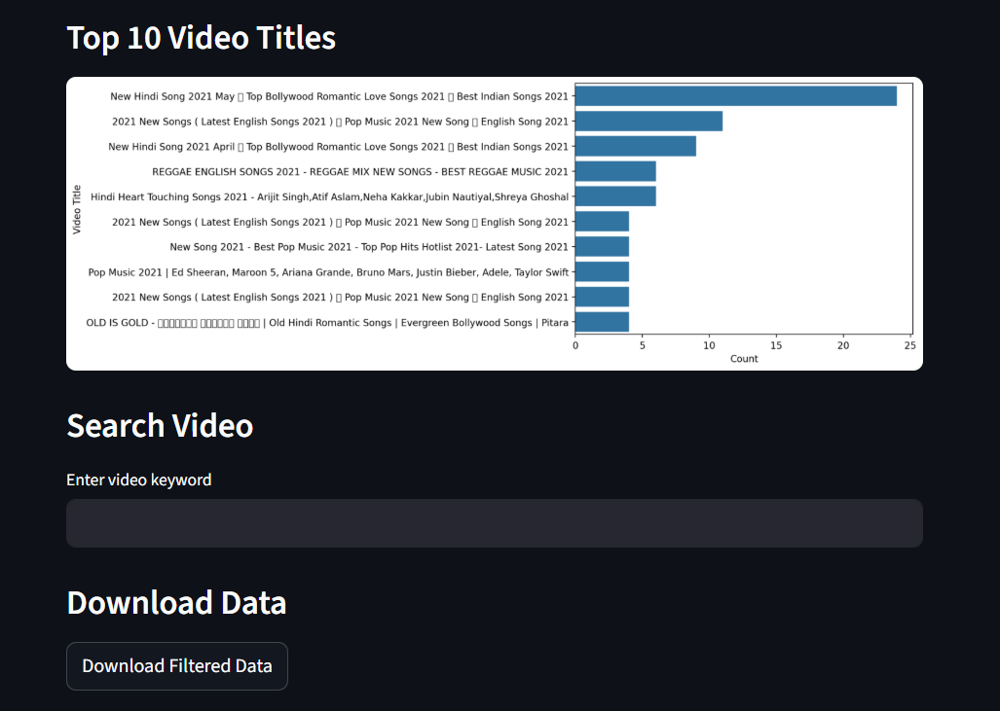

# YouTube Analytics Dashboard

This project analyzes YouTube video data and provides insights using Python, Pandas, and Streamlit.

## Tech Stack
- Python
- Pandas
- Streamlit
- Matplotlib / Seaborn

## Features
- Analyze views, likes, comments
- Data cleaning and preprocessing
- Interactive dashboard using Streamlit
- Visual insights from YouTube dataset

## How to Run

1. Clone the repository  
2. Install dependencies:
   pip install -r requirements.txt  
3. Run the app:
   streamlit run app.py  

## Output

## Files
- app.py → main dashboard application  
- analysis.ipynb → data analysis notebook  
- youtube_videos.csv → dataset  
- requirements.txt → dependencies  
